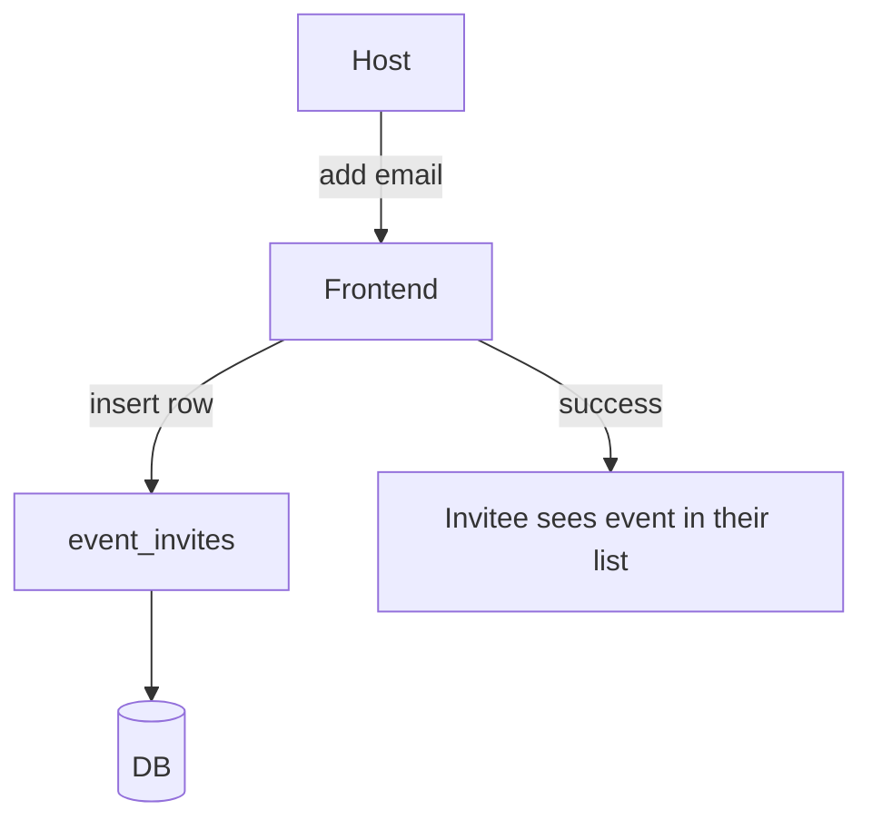
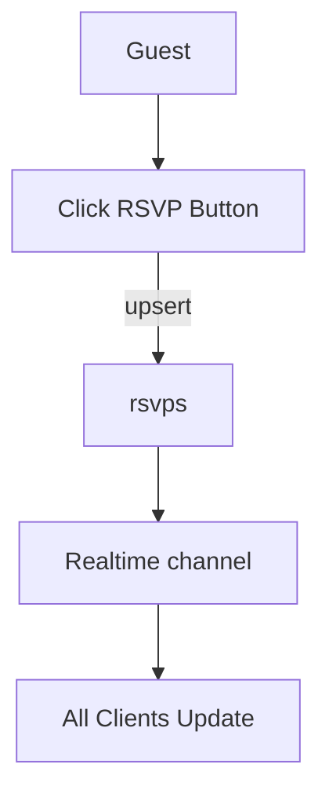
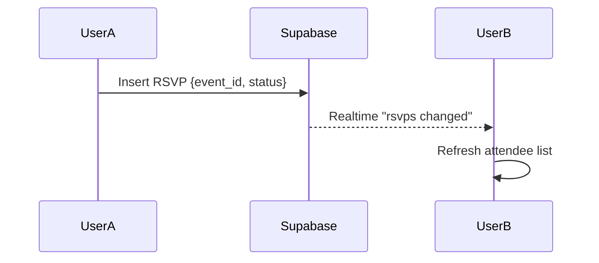

# Event RSVP (Team Calendar Lite)

## 📌 Overview
This is a small web app built with **ReactJS** (frontend) and **Supabase** (backend).  
The goal is to practice **Realtime + CRUD + Auth + RLS** using a practical use case:  
Users can create events, invite others, and track RSVPs in realtime.

---

## 🎯 Goals
- Learn Supabase **Authentication** (email/password, OAuth).
- Implement **Row-Level Security (RLS)** so users only see events they’re invited to.
- Practice **CRUD operations** (create/update/delete events, RSVPs, comments).
- Use **Realtime subscriptions** so event details update live across sessions.

---

## ✨ Features
### MVP
1. **User Auth**
   - Sign up / Login / Logout.
   - Profile page with display name.

2. **Events**
   - Create event (title, date/time, description).
   - Edit/delete only if you are the host.
   - List all events you are invited to.

3. **RSVP**
   - Options: Yes / No / Maybe.
   - Each user can update their RSVP.
   - Realtime attendee list.

4. **Comments (optional extension)**
   - Add comments under an event.
   - Live comment feed.

---

## 🏗️ Architecture

### Frontend
- **ReactJS + Vite**
- **MUI** for UI components.
- **React Query** for data fetching/mutation.
- **Supabase client SDK** for auth, database, realtime.

### Backend
- **Supabase Postgres** with:
  - Tables: `profiles`, `events`, `event_invites`, `rsvps`, `comments`
  - RLS policies for security.
  - Triggers to keep `updated_at` fresh.

---

## 📊 Database Schema

```sql
-- Profiles (mirror of auth.users)
create table public.profiles (
  id uuid primary key references auth.users(id) on delete cascade,
  display_name text,
  avatar_url text,
  created_at timestamptz default now()
);

-- Events
create table public.events (
  id uuid primary key default gen_random_uuid(),
  host_id uuid not null references auth.users(id),
  title text not null,
  description text,
  event_date timestamptz not null,
  created_at timestamptz default now(),
  updated_at timestamptz default now()
);

-- Invitations (who can see an event)
create table public.event_invites (
  event_id uuid references public.events(id) on delete cascade,
  user_id uuid references auth.users(id) on delete cascade,
  role text check (role in ('host','guest')) default 'guest',
  primary key (event_id, user_id)
);

-- RSVP (per user per event)
create table public.rsvps (
  event_id uuid references public.events(id) on delete cascade,
  user_id uuid references auth.users(id) on delete cascade,
  status text check (status in ('yes','no','maybe')) not null,
  updated_at timestamptz default now(),
  primary key (event_id, user_id)
);

-- Comments (optional)
create table public.comments (
  id uuid primary key default gen_random_uuid(),
  event_id uuid not null references public.events(id) on delete cascade,
  user_id uuid not null references auth.users(id),
  content text not null,
  created_at timestamptz default now()
);
```

---

## 🔒 Row-Level Security (RLS)

Enable RLS on all tables and add policies:

- **events**
  - `select`: if user is in `event_invites`.
  - `insert`: allowed if `host_id = auth.uid()`.
  - `update/delete`: only host.

- **event_invites**
  - `select`: only if `user_id = auth.uid()` or host of event.
  - `insert`: only host can add invites.

- **rsvps**
  - `select`: only if user is invited to event.
  - `insert/update`: only if `user_id = auth.uid()`.

- **comments**
  - `select`: only if invited.
  - `insert`: only if `user_id = auth.uid()`.

---

## 🔄 Workflows

### 1. Create Event
```mermaid
flowchart TD
    U[User (host)] -->|fills form| FE[React Form]
    FE -->|insert| SB[Supabase.events]
    SB --> INV[event_invites row for host]
    FE -->|success| UI[Show event in host's event list]
```

### 2. Invite User


### 3. RSVP


### 4. Live Updates


---

## 📐 UI Sketch (MVP)

- **Login Page**
- **Events List**
  - Card with Title, Date, RSVP counts.
- **Event Detail**
  - Event info (host, date, description).
  - RSVP buttons: Yes / No / Maybe.
  - List of attendees (live).
  - Comment section (optional).

---

## 🚀 Development Plan

### Day 1
- Set up Supabase project.
- Create schema + RLS policies.
- Implement auth (sign up, login, logout).
- Build profiles table.

### Day 2
- CRUD for events.
- Event list + detail page.
- Realtime subscription for RSVPs.

### Day 3
- Implement invitations.
- RSVP buttons with live updates.
- Polish UI.

### Stretch Goals
- Add comments feed.
- Add role-based permissions (host vs guest).
- Add email invites via Supabase Edge Functions.
- Add analytics (count RSVPs).

---

## ✅ Deliverables
- Working React app connected to Supabase.
- Code with clear folder structure:
  ```
  src/
    supabaseClient.ts
    components/
      Auth.tsx
      EventList.tsx
      EventDetail.tsx
    hooks/
      useEvents.ts
      useRSVP.ts
  ```
- Documentation for setup and RLS policies.
